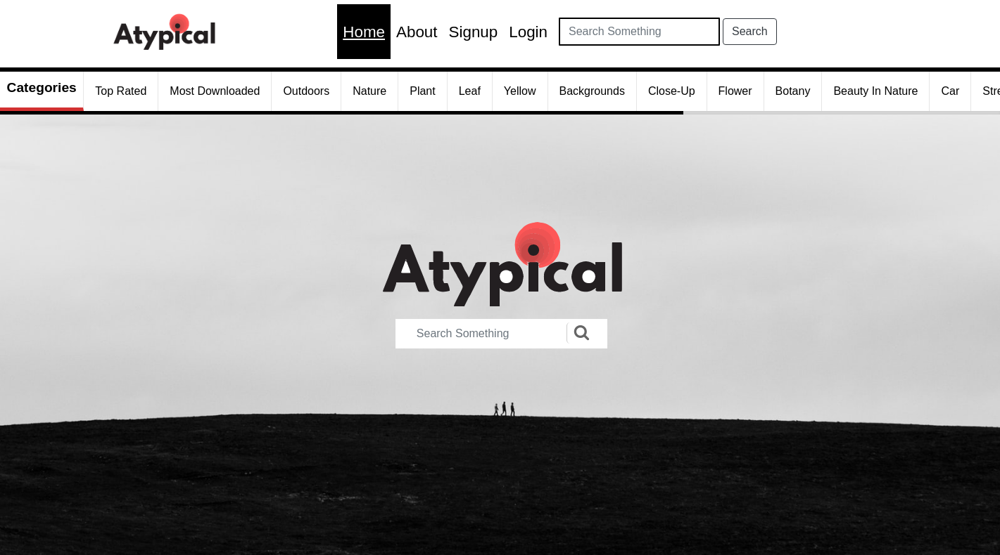
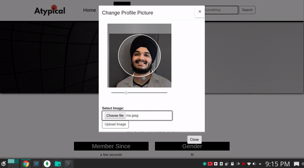
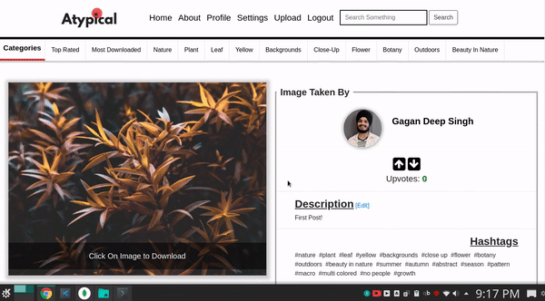
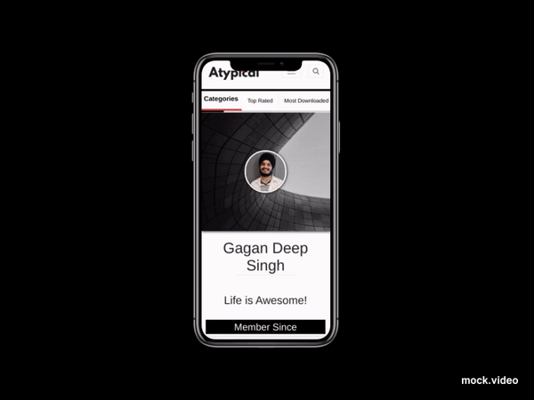

# Atypical
## Stock Image Site



People like **Graphic Designers, Artists and Content Creators** can *search and download* 
pictures required for their work from this site. This site is easy to use and is made with
the purpose anyone can use this site. It's clean and elegant. It uses *masonry layout*
for rendering images for the sole purpose of making them visually appealing.



Images can be uploaded after Signing up to the site and will be categorized using **Everypixel**.
It harnessess the power of **Everypixel** for making images searchable by keywording each image at
the time of upload.



## It consists of:
+ HTML
+ CSS
+ JavaScript
+ jQuery
+ Ajax
+ Boostrap 4
+ CroppieJS
+ MomentJS
+ Python
+ Flask
+ MongoDB

# Responsive Web Design 😎


# Requirements
1. Python 3.7.x
2. MongoDB 4.x
3. An Account on Everypixel

# Usage
1. Clone the repository by running `git clone https://github.com/gagangulyani/Atypical.git`
2. Install Requirements for **Python 3** by running `pip install -r requirements.txt` after navigating into **Atypical** directory which you just *cloned*
3. Create a file `config_api.json` in `models` directory and Paste the following snippet replacing `ClientID` and `Secret` value by your **Everypixel**'s *Client ID* and *Secret*
    ```
    {
        "ClientID": "PASTE YOUR CLIENT ID HERE",
        "Secret": "PASTE YOUR SECRET KEY HERE"
    }
    ```
4. Finally, run `python routes.py` and open `localhost:5000` in your browser (preferably chrome)
5. **Signup** for making your account and start posting your *best pictures!*

##### Note:
+ There won't be any content on site to download in the beginning so User has to intially Signup and create an account for posting his images for testing the Web App
+ Feel Free to checkout some images of the site consisting of two posts for now by <a href='images/' target='_blank'>Clicking here</a> 

### Contact:
For Reporting Bugs or Suggesting Changes, <a href="mailto:gagangulyanig@gmail.com">Click Here to Mail Me</a> :)